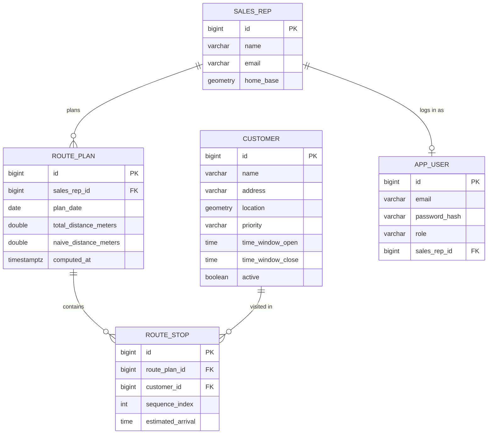
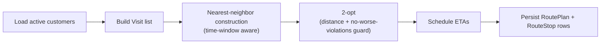

# Routely

*[English](README.md) · [Español](README.es.md)*

Planificación de rutas de ventas de campo para comerciales que hoy en día ordenan sus visitas a
ojo.

[](https://github.com/RoberAF/routely/actions/workflows/ci.yml)

## Por qué

Los comerciales con una lista de 20-40 clientes que visitar en un día casi siempre ordenan esa
lista a mano: alfabéticamente, según el orden en que estuviera la hoja de cálculo, o de memoria,
por «quién está cerca de quién». Nada de eso es óptimo, y la diferencia entre una lista manual y
hasta la heurística más simple se traduce en tiempo de conducción real a lo largo de una semana.

Routely toma un comercial, un día y un conjunto de clientes, y devuelve una secuencia de visitas:
construcción por vecino más cercano sobre geografía real (PostGIS), mejorada con 2-opt, con horas
de llegada estimadas respecto al horario de apertura de cada cliente. No es un solver de VRP — no
hay capacidad de vehículo, ni planificación multi-día, ni modelo de tráfico —, pero mejora de
forma consistente una lista sin ordenar, y es honesto sobre lo que es: una heurística, no una
solución exacta.

**Nota sobre el ecosistema:** la aplicación móvil complementaria,
[`routely-app`](https://github.com/RoberAF/routely-app) (iOS/Android, mismo autor), está en
desarrollo — es la interfaz diaria real del comercial de campo para esta API.

## Pruébalo en el navegador

**[roberaf.github.io/routely](https://roberaf.github.io/routely/)** — un pequeño mapa Leaflet
sobre el mismo conjunto de datos de 40 clientes de Galicia, con un port a TypeScript del
optimizador de vecino más cercano + 2-opt (`web/src/optimizer.ts`). Elige la base de un comercial,
elige algunos clientes (o simplemente enruta a todos los activos), pulsa «Calcular ruta» y compara
lado a lado las polilíneas de la ruta ingenua y la optimizada. Funciona íntegramente en el
cliente — sin backend, sin base de datos, solo el mismo algoritmo que el servicio Java.

En local:

```bash
cd web
npm install
npm run dev
```

## Funcionalidades

- API REST protegida con JWT (roles `ADMIN` / `MANAGER` / `REP`), tokens HS256 sin estado
- CRUD ligero de clientes con paginación sin cursor y una búsqueda `/nearby` respaldada por PostGIS
- Cálculo de rutas: vecino más cercano + 2-opt sobre distancias haversine, con un paso de
  construcción consciente de las franjas horarias y una protección de «no empeorar las
  infracciones» en el paso de mejora de 2-opt
- Aislamiento por comercial: un `REP` solo puede leer sus propios planes de ruta; `ADMIN`/`MANAGER`
  pueden calcular y leer los de todo el equipo
- RFC 7807 `application/problem+json` en cada respuesta de error, sin stack traces desnudos
- OpenAPI/Swagger UI en `/swagger-ui.html` en cuanto la aplicación está en marcha
- Sembrado con un dataset real (aunque ficticio) de Galicia: tres comerciales con base en Lugo,
  Monforte y Ourense, y 40 clientes que van desde la ciudad de Lugo hasta pueblos a 15+ km de
  distancia, de forma que `/nearby` y el optimizador tienen ambos algo no trivial que masticar

## Arquitectura



El propio pipeline de optimización, desde una llamada a `POST /route-plans/compute` hasta un plan
persistido:



## Inicio rápido

```bash
docker compose up --build
```

Esto levanta una base de datos PostGIS 16 (Flyway la migra al arrancar, sembrando la fixture de
Galicia) y la API en `http://localhost:8080`. Cuentas de demostración, todas pre-sembradas:

| Email                  | Password    | Role    |
|-------------------------|-------------|---------|
| `admin@routely.dev`    | `admin123`  | ADMIN   |
| `manager@routely.dev`  | `manager123`| MANAGER |
| `laura@routely.dev`    | `laura123`  | REP (Laura Castro, con base en Lugo)   |
| `brais@routely.dev`    | `brais123`  | REP (Brais Seoane, con base en Monforte) |

### Iniciar sesión

```bash
curl.exe -s -X POST http://localhost:8080/api/v1/auth/login \
  -H "Content-Type: application/json" \
  -d "{\"email\":\"manager@routely.dev\",\"password\":\"manager123\"}"
```

```json
{"accessToken":"eyJhbGciOiJIUzI1NiJ9...","tokenType":"Bearer","expiresInSeconds":28800}
```

El resto de llamadas de abajo asume que `%TOKEN%` (o `%LAURA_TOKEN%`) contiene ese `accessToken`
para la cuenta correspondiente — `set TOKEN=...` en `cmd.exe`, `$env:TOKEN = "..."` en PowerShell,
o `TOKEN=...` en bash.

### Listar clientes (paginado)

```bash
curl.exe -s "http://localhost:8080/api/v1/customers?page=0&size=5" -H "Authorization: Bearer %TOKEN%"
```

```json
{"content":[{"id":1,"name":"Cafetería Rúa Nova","address":"Rúa Nova 12, Lugo","lat":43.0096,"lng":-7.556,"priority":"NORMAL","timeWindowOpen":null,"timeWindowClose":null,"active":true},{"id":2,"name":"Estanco Porta Miñá","address":"Porta Miñá 3, Lugo","lat":43.008,"lng":-7.562,"priority":"NORMAL","timeWindowOpen":"09:30:00","timeWindowClose":"13:30:00","active":true},{"id":3,"name":"Ferretería As Termas","address":"Rúa das Termas 5, Lugo","lat":43.0205,"lng":-7.549,"priority":"KEY","timeWindowOpen":null,"timeWindowClose":null,"active":true},{"id":4,"name":"Panadería O Ceao","address":"Rúa Illa de Sálvora 2, O Ceao, Lugo","lat":43.041,"lng":-7.571,"priority":"LOW","timeWindowOpen":null,"timeWindowClose":null,"active":true},{"id":5,"name":"Quiosco Parque Rosalía","address":"Parque Rosalía de Castro, Lugo","lat":43.011,"lng":-7.558,"priority":"NORMAL","timeWindowOpen":null,"timeWindowClose":null,"active":false}],"page":0,"size":5,"totalElements":40,"totalPages":8}
```

(el cliente 5, el quiosco inactivo, aparece aquí — la paginación lista todo; `/nearby` es el que
filtra solo los clientes activos)

### Obtener un cliente por id

```bash
curl.exe -s "http://localhost:8080/api/v1/customers/1" -H "Authorization: Bearer %TOKEN%"
```

```json
{"id":1,"name":"Cafetería Rúa Nova","address":"Rúa Nova 12, Lugo","lat":43.0096,"lng":-7.556,"priority":"NORMAL","timeWindowOpen":null,"timeWindowClose":null,"active":true}
```

### Búsqueda por cercanía (Lugo, 2 km alrededor del centro de la ciudad)

```bash
curl.exe -s "http://localhost:8080/api/v1/customers/nearby?lat=43.0121&lng=-7.5559&radiusMeters=2000" \
  -H "Authorization: Bearer %TOKEN%"
```

Devuelve exactamente los tres clientes activos de Lugo más cercanos, ordenados por distancia (ids
1, 2, 3 — el quiosco inactivo, id 5, y todo lo que está a 15+ km de distancia nunca aparece aquí
sin importar el radio, y un token ausente o inválido recibe un `401 application/problem+json` en
lugar de datos).

### Crear un cliente

```bash
curl.exe -s -i -X POST http://localhost:8080/api/v1/customers \
  -H "Authorization: Bearer %TOKEN%" -H "Content-Type: application/json" \
  -d "{\"name\":\"Test Shop\",\"address\":\"Test Address 1\",\"lat\":43.01,\"lng\":-7.55,\"priority\":\"NORMAL\"}"
```

```
HTTP/1.1 201
Location: /api/v1/customers/41

{"id":41,"name":"Test Shop","address":"Test Address 1","lat":43.01,"lng":-7.55,"priority":"NORMAL","timeWindowOpen":null,"timeWindowClose":null,"active":true}
```

### Calcular un plan de ruta

```bash
curl.exe -s -X POST http://localhost:8080/api/v1/route-plans/compute \
  -H "Authorization: Bearer %TOKEN%" -H "Content-Type: application/json" \
  -d "{\"repId\":1,\"planDate\":\"2026-07-23\",\"customerIds\":[1,2,3,4]}"
```

Esta es la respuesta real capturada contra un stack de compose en marcha — cuatro paradas en Lugo,
así que no hay mucho margen para que 2-opt encuentre algo:

```json
{
  "id": 2,
  "repId": 1,
  "planDate": "2026-07-23",
  "totalDistanceMeters": 8869.145930952604,
  "naiveDistanceMeters": 8880.735375491244,
  "improvementPercent": 0.13050095570491155,
  "timeWindowViolations": 0,
  "computedAt": "2026-07-15T20:13:47.972276434Z",
  "stops": [
    {"customerId": 2, "customerName": "Estanco Porta Miñá", "sequenceIndex": 0, "lat": 43.008, "lng": -7.562, "estimatedArrival": "09:30:00"},
    {"customerId": 1, "customerName": "Cafetería Rúa Nova", "sequenceIndex": 1, "lat": 43.0096, "lng": -7.556, "estimatedArrival": "09:45:37.389211352"},
    {"customerId": 3, "customerName": "Ferretería As Termas", "sequenceIndex": 2, "lat": 43.0205, "lng": -7.549, "estimatedArrival": "10:02:13.796694511"},
    {"customerId": 4, "customerName": "Panadería O Ceao", "sequenceIndex": 3, "lat": 43.041, "lng": -7.571, "estimatedArrival": "10:20:42.395295839"}
  ]
}
```

Si se omite `customerIds`, enruta en su lugar a todos los clientes activos. Hacer eso para el
mismo comercial (los 39 clientes activos, repartidos por la provincia de Lugo) es donde 2-opt
realmente se gana el sueldo — la misma ejecución, capturada contra el mismo stack: **811.828 m
optimizados frente a 1.978.235 m en la ruta ingenua, una mejora del 58,96 %**.

### Listar planes como REP

```bash
curl.exe -s "http://localhost:8080/api/v1/route-plans?repId=1" -H "Authorization: Bearer %LAURA_TOKEN%"
```

```json
[{"id":1,"repId":1,"planDate":"2026-07-22","totalDistanceMeters":811828.009191291,"naiveDistanceMeters":1978235.4495060844,"improvementPercent":58.962012868893645,"timeWindowViolations":2,"computedAt":"2026-07-15T20:13:37.324120Z","stops":[ "..." ]}]
```

### Aislamiento por comercial: un REP leyendo los planes de otro comercial

```bash
curl.exe -s -i "http://localhost:8080/api/v1/route-plans?repId=2" -H "Authorization: Bearer %LAURA_TOKEN%"
```

```
HTTP/1.1 403
Content-Type: application/problem+json

{"detail":"cannot read another sales rep's plans","instance":"/api/v1/route-plans","status":403,"title":"Forbidden"}
```

Laura (`repId=1`) puede listar y leer sus propios planes y los de nadie más; la misma regla se
aplica a `GET /route-plans/{id}` para un plan que no sea suyo.

## Ejecutar los tests

```bash
./mvnw test        # unit tests only (fast, no Docker)
./mvnw verify       # unit + integration tests (spins up a real postgis/postgis container)
```

Windows (cmd/PowerShell), mismos objetivos a través del wrapper `.cmd` incluido:

```bat
mvnw.cmd test
mvnw.cmd verify
```

`verify` necesita Docker en marcha localmente (Testcontainers descarga `postgis/postgis:16-3.4` y
lo arranca una vez, compartido entre toda la suite de tests de integración). Los tests de
integración levantan el contexto completo de Spring contra ese contenedor, ejecutan las
migraciones reales de Flyway, y ejercitan la API HTTP de extremo a extremo — incluyendo las reglas
de aislamiento por comercial — en lugar de simular la capa de servicio.

## Decisiones de diseño

**Vecino más cercano + 2-opt, no OR-Tools ni un solver de VRP exacto.** Un solver real es la
decisión correcta para un producto de enrutamiento de flotas en producción, pero es una
dependencia pesada para lo que este proyecto está demostrando, y para un único comercial que
visita unas pocas decenas de clientes al día, NN+2-opt se acerca bastante al óptimo en la
práctica. 2-opt en particular elimina los cruces de caminos que deja una construcción puramente de
vecino más cercano, que es de donde viene la mayor parte de la mejora medible (ver la cifra del
58,96 % de arriba).

**Haversine, no distancias por carretera.** Las distancias son cotas inferiores de círculo
máximo, no distancias de conducción — no hay ninguna dependencia externa de enrutamiento que
levantar para un proyecto de demostración. Esto significa que el optimizador es sistemáticamente
un poco optimista frente a las carreteras reales, lo cual es una limitación honesta, no un bug. La
integración con OSRM es el siguiente paso natural (ver Roadmap).

**Franjas horarias voraces (greedy), no un solver VRPTW real.** La construcción por vecino más
cercano prefiere, cuando puede, la siguiente parada factible (aquella cuya franja horaria sigue
abierta) frente a la estrictamente más cercana, y el paso de 2-opt solo acepta un intercambio si no
aumenta el número de infracciones. Es una heurística que prioriza la factibilidad, no una
garantía: `timeWindowViolations` en la respuesta es un número que la API *informa*, no uno que
prometa reducir a cero. Resolver esto correctamente necesita un solver de restricciones real.

**PostGIS para `/nearby`, Java puro para el bucle del optimizador.** El endpoint nearby es una
única consulta espacial indexada (`ST_DWithin` contra un índice GiST sobre
`customer.location::geography`) — para eso está exactamente PostGIS. La optimización de rutas, en
cambio, ejecuta docenas de cálculos de distancia por cada intercambio candidato; hacerlo como una
llamada a la función haversine por par en memoria es a la vez más simple y más rápido que un
round-trip a la base de datos por cada comparación.

## Hoja de ruta

- Distancias por carretera respaldadas por OSRM en lugar de haversine
- VRP multi-vehículo / multi-comercial (actualmente se calcula la ruta de un comercial cada vez)
- Un solver de franjas horarias como es debido, en lugar de la construcción voraz + la protección
  de no empeorar
- Filtrado de territorio basado en isócronas («clientes alcanzables en menos de 30 min desde la
  base»)

## Licencia

MIT — ver [`LICENSE`](LICENSE).
