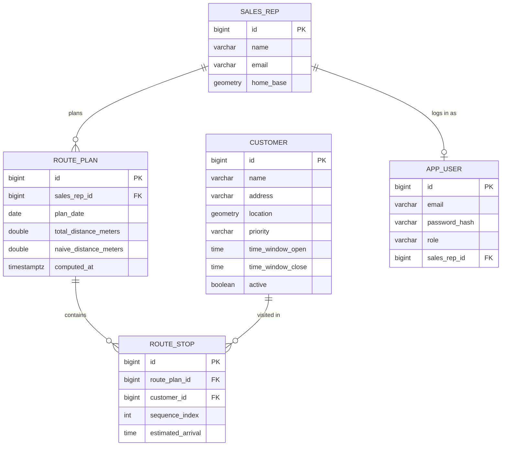

# Routely

Field-sales route planning for reps who are currently ordering their visits by gut feeling.

[](https://github.com/RoberAF/routely/actions/workflows/ci.yml)

## Why

Sales reps with a list of 20-40 customers to visit in a day almost always order that list by
hand: alphabetically, by whatever order the spreadsheet happened to be in, or by memory of "who's
near who". None of that is optimal, and the gap between a manual list and even a simple heuristic
adds up to real driving time over a week.

Routely takes a rep, a day, and a set of customers, and returns a visit sequence: nearest-neighbor
construction over real geography (PostGIS), improved with 2-opt, with arrival times estimated
against each customer's opening hours. It is not a VRP solver — there's no vehicle capacity, no
multi-day planning, no traffic model — but it consistently beats an unordered list, and it's
honest about what it is: a heuristic, not an exact solution.

**Ecosystem note:** the companion mobile app, [`routely-app`](https://github.com/RoberAF/routely-app)
(iOS/Android, same author), is in development — it's the field rep's actual daily interface to
this API.

## Features

- JWT-secured REST API (`ADMIN` / `MANAGER` / `REP` roles), stateless HS256 tokens
- Customer CRUD-lite with cursor-free paging and a PostGIS-backed `/nearby` search
- Route computation: nearest-neighbor + 2-opt over haversine distances, with a time-window-aware
  construction step and a "don't make violations worse" guard on the 2-opt improvement pass
- Rep isolation: a `REP` can only ever read their own route plans; `ADMIN`/`MANAGER` can compute
  and read across the whole team
- RFC 7807 `application/problem+json` for every error response, no bare stack traces
- OpenAPI/Swagger UI at `/swagger-ui.html` once the app is running
- Seeded with a real (if fictional) Galicia dataset: three reps based in Lugo, Monforte and
  Ourense, and 40 customers spanning Lugo city out to towns 15+ km away, so `/nearby` and the
  optimizer both have something non-trivial to chew on

## Architecture



The optimization pipeline itself, from a `POST /route-plans/compute` call to a persisted plan:


## Quickstart

```bash
docker compose up --build
```

This brings up a PostGIS 16 database (Flyway migrates it on boot, seeding the Galicia fixture)
and the API on `http://localhost:8080`. Demo accounts, all pre-seeded:

| Email                  | Password    | Role    |
|-------------------------|-------------|---------|
| `admin@routely.dev`    | `admin123`  | ADMIN   |
| `manager@routely.dev`  | `manager123`| MANAGER |
| `laura@routely.dev`    | `laura123`  | REP (Laura Castro, based in Lugo)   |
| `brais@routely.dev`    | `brais123`  | REP (Brais Seoane, based in Monforte) |

### Log in

```bash
curl.exe -s -X POST http://localhost:8080/api/v1/auth/login \
  -H "Content-Type: application/json" \
  -d "{\"email\":\"manager@routely.dev\",\"password\":\"manager123\"}"
```

```json
{"accessToken":"eyJhbGciOiJIUzI1NiJ9...","tokenType":"Bearer","expiresInSeconds":28800}
```

Every other call below assumes `%TOKEN%` (or `%LAURA_TOKEN%`) holds that `accessToken` for the
relevant account — `set TOKEN=...` in `cmd.exe`, `$env:TOKEN = "..."` in PowerShell, or
`TOKEN=...` in bash.

### List customers (paged)

```bash
curl.exe -s "http://localhost:8080/api/v1/customers?page=0&size=5" -H "Authorization: Bearer %TOKEN%"
```

```json
{"content":[{"id":1,"name":"Cafetería Rúa Nova","address":"Rúa Nova 12, Lugo","lat":43.0096,"lng":-7.556,"priority":"NORMAL","timeWindowOpen":null,"timeWindowClose":null,"active":true},{"id":2,"name":"Estanco Porta Miñá","address":"Porta Miñá 3, Lugo","lat":43.008,"lng":-7.562,"priority":"NORMAL","timeWindowOpen":"09:30:00","timeWindowClose":"13:30:00","active":true},{"id":3,"name":"Ferretería As Termas","address":"Rúa das Termas 5, Lugo","lat":43.0205,"lng":-7.549,"priority":"KEY","timeWindowOpen":null,"timeWindowClose":null,"active":true},{"id":4,"name":"Panadería O Ceao","address":"Rúa Illa de Sálvora 2, O Ceao, Lugo","lat":43.041,"lng":-7.571,"priority":"LOW","timeWindowOpen":null,"timeWindowClose":null,"active":true},{"id":5,"name":"Quiosco Parque Rosalía","address":"Parque Rosalía de Castro, Lugo","lat":43.011,"lng":-7.558,"priority":"NORMAL","timeWindowOpen":null,"timeWindowClose":null,"active":false}],"page":0,"size":5,"totalElements":40,"totalPages":8}
```

(customer 5, the inactive kiosk, shows up here — paging lists everything; `/nearby` is the one
that filters to active customers only)

### Get a customer by id

```bash
curl.exe -s "http://localhost:8080/api/v1/customers/1" -H "Authorization: Bearer %TOKEN%"
```

```json
{"id":1,"name":"Cafetería Rúa Nova","address":"Rúa Nova 12, Lugo","lat":43.0096,"lng":-7.556,"priority":"NORMAL","timeWindowOpen":null,"timeWindowClose":null,"active":true}
```

### Nearby search (Lugo, 2 km around the city center)

```bash
curl.exe -s "http://localhost:8080/api/v1/customers/nearby?lat=43.0121&lng=-7.5559&radiusMeters=2000" \
  -H "Authorization: Bearer %TOKEN%"
```

Returns exactly the three closest active Lugo customers, ordered by distance (ids 1, 2, 3 — the
inactive kiosk, id 5, and everything 15+ km away never shows up here regardless of radius, and a
missing/invalid token gets a `401 application/problem+json` instead of data).

### Create a customer

```bash
curl.exe -s -i -X POST http://localhost:8080/api/v1/customers \
  -H "Authorization: Bearer %TOKEN%" -H "Content-Type: application/json" \
  -d "{\"name\":\"Test Shop\",\"address\":\"Test Address 1\",\"lat\":43.01,\"lng\":-7.55,\"priority\":\"NORMAL\"}"
```

```
HTTP/1.1 201
Location: /api/v1/customers/41

{"id":41,"name":"Test Shop","address":"Test Address 1","lat":43.01,"lng":-7.55,"priority":"NORMAL","timeWindowOpen":null,"timeWindowClose":null,"active":true}
```

### Compute a route plan

```bash
curl.exe -s -X POST http://localhost:8080/api/v1/route-plans/compute \
  -H "Authorization: Bearer %TOKEN%" -H "Content-Type: application/json" \
  -d "{\"repId\":1,\"planDate\":\"2026-07-23\",\"customerIds\":[1,2,3,4]}"
```

This is the real response captured against a running compose stack — four Lugo stops, so there
isn't much slack for 2-opt to find:

```json
{
  "id": 2,
  "repId": 1,
  "planDate": "2026-07-23",
  "totalDistanceMeters": 8869.145930952604,
  "naiveDistanceMeters": 8880.735375491244,
  "improvementPercent": 0.13050095570491155,
  "timeWindowViolations": 0,
  "computedAt": "2026-07-15T20:13:47.972276434Z",
  "stops": [
    {"customerId": 2, "customerName": "Estanco Porta Miñá", "sequenceIndex": 0, "lat": 43.008, "lng": -7.562, "estimatedArrival": "09:30:00"},
    {"customerId": 1, "customerName": "Cafetería Rúa Nova", "sequenceIndex": 1, "lat": 43.0096, "lng": -7.556, "estimatedArrival": "09:45:37.389211352"},
    {"customerId": 3, "customerName": "Ferretería As Termas", "sequenceIndex": 2, "lat": 43.0205, "lng": -7.549, "estimatedArrival": "10:02:13.796694511"},
    {"customerId": 4, "customerName": "Panadería O Ceao", "sequenceIndex": 3, "lat": 43.041, "lng": -7.571, "estimatedArrival": "10:20:42.395295839"}
  ]
}
```

Leave out `customerIds` and it routes every active customer instead. Doing that for the same rep
(all 39 active customers, scattered across Lugo province) is where 2-opt actually earns its
keep — the same run, captured against the same stack: **811,828 m optimized vs. 1,978,235 m naive,
a 58.96% improvement**.

### List plans as a REP

```bash
curl.exe -s "http://localhost:8080/api/v1/route-plans?repId=1" -H "Authorization: Bearer %LAURA_TOKEN%"
```

```json
[{"id":1,"repId":1,"planDate":"2026-07-22","totalDistanceMeters":811828.009191291,"naiveDistanceMeters":1978235.4495060844,"improvementPercent":58.962012868893645,"timeWindowViolations":2,"computedAt":"2026-07-15T20:13:37.324120Z","stops":[ "..." ]}]
```

### Rep isolation: a REP reading another rep's plans

```bash
curl.exe -s -i "http://localhost:8080/api/v1/route-plans?repId=2" -H "Authorization: Bearer %LAURA_TOKEN%"
```

```
HTTP/1.1 403
Content-Type: application/problem+json

{"detail":"cannot read another sales rep's plans","instance":"/api/v1/route-plans","status":403,"title":"Forbidden"}
```

Laura (`repId=1`) can list and read her own plans and nobody else's; the same rule applies to
`GET /route-plans/{id}` for a plan that isn't hers.

## Running tests

```bash
./mvnw test        # unit tests only (fast, no Docker)
./mvnw verify       # unit + integration tests (spins up a real postgis/postgis container)
```

Windows (cmd/PowerShell), same targets via the bundled `.cmd` wrapper:

```bat
mvnw.cmd test
mvnw.cmd verify
```

`verify` needs Docker running locally (Testcontainers pulls `postgis/postgis:16-3.4` and starts it
once, shared across the integration test suite). The integration tests boot the full Spring
context against that container, run the real Flyway migrations, and drive the HTTP API end to end
— including the rep-isolation rules — rather than mocking the service layer.

## Design decisions

**Nearest-neighbor + 2-opt, not OR-Tools or an exact VRP solver.** A real solver is the right call
for a production fleet-routing product, but it's a heavy dependency for what this project is
demonstrating, and for a single rep visiting a few dozen customers a day, NN+2-opt gets close to
optimal in practice. 2-opt in particular removes the crossing paths that a pure nearest-neighbor
construction leaves behind, which is where most of the measurable improvement (see the 58.96%
figure above) actually comes from.

**Haversine, not road distances.** Distances are great-circle lower bounds, not driving distances
— there's no external routing dependency to stand up for a demo project. This means the optimizer
is systematically a little optimistic versus real roads, which is an honest limitation, not a
bug. OSRM integration is the natural next step (see Roadmap).

**Greedy time windows, not a real VRPTW solver.** The nearest-neighbor construction prefers
feasible next stops (ones whose window is still open) over strictly-closest ones when it can, and
the 2-opt pass only accepts a swap if it doesn't increase the violation count. That's a
feasibility-preferring heuristic, not a guarantee: `timeWindowViolations` in the response is a
number the API *reports*, not one it promises to drive to zero. Solving that properly needs an
actual constraint solver.

**PostGIS for `/nearby`, pure Java for the optimizer loop.** The nearby endpoint is a single
indexed spatial query (`ST_DWithin` against a GiST index on `customer.location::geography`) —
that's exactly what PostGIS is for. Route optimization, on the other hand, runs dozens of distance
calculations per candidate swap; doing that as one haversine function call per pair in memory is
both simpler and faster than a DB round-trip per comparison.

## Roadmap

- OSRM-backed road distances instead of haversine
- Multi-vehicle / multi-rep VRP (currently one rep's route at a time)
- A proper time-window solver instead of the greedy construction + non-worsening guard
- Isochrone-based territory filtering ("customers reachable within 30 min of home base")

## License

MIT — see [`LICENSE`](LICENSE).
